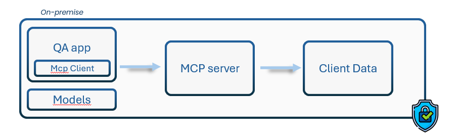

# MCP FastAPI UI Project



QA application integrated with MCP (Model Context Protocal) on a fastapi api and a PostgreSQL database, designed to run with Docker Compose.

## Prerequisites

*   Docker and Docker Compose
*   Python >= 3.12 (for local development without Docker)
*   `uv` (Python package installer, if running locally without Docker)

## Setup

1.  **Clone the repository:**
    ```bash
    git clone <your-repo-url>
    cd mcp-fastapi-ui
    ```

2.  **Create Environment File:**
    Create a `.env` file in the project root directory with the following variables:
    ```env
    POSTGRES_USER=your_db_user
    POSTGRES_PASSWORD=your_db_password
    POSTGRES_DB=your_db_name

    # Optional: Port for Open WebUI (defaults to 3000)
    # HOST_URL=http://localhost
    # OPEN_WEBUI_PORT=80
    ```
    Replace `your_db_user`, `your_db_password`, and `your_db_name` with your desired PostgreSQL credentials.

## Running with Docker Compose (Recommended)

This is the easiest way to run the application and all its services (FastAPI app, PostgreSQL database, Open WebUI).

1.  **Build and start the containers:**
    ```bash
    docker-compose up --build -d
    ```
    *   `-d` runs the containers in detached mode (in the background).
    *   `--build` ensures the images are built if they don't exist or if the Dockerfile has changed.

2.  **Access the services:**
    *   **FastAPI App:** `http://localhost:8000`
    *   **FastAPI Docs (Swagger UI):** `http://localhost:8000/docs`
    *   **Open WebUI:** `http://localhost:${OPEN_WEBUI_PORT:-3000}` (or the port you specified in `.env`)
    *   **MCP Remote Runner:** Port `5000` is exposed, but direct access depends on its specific function.

3.  **Stopping the services:**
    ```bash
    docker-compose down
    ```
